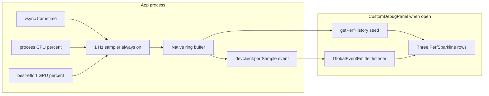

<!-- 1dc21125-3e0c-4ab5-9495-34b8b8d7f5ff -->
---
todos:
  - id: "android-sampler"
    content: "PerfSampler.kt singleton: Choreographer frametime, /proc/self/stat CPU%, best-effort kgsl/mali GPU%. Always-on ring buffer. Auto-start on attachHostActivity, stop on last detach."
    status: pending
  - id: "android-devclient"
    content: "DevClientModule.kt: @LynxMethod getPerfHistory(callback); emit devclient:perfSample via sendGlobalEvent for every tick (panel subscribes when open). No start/stop from JS."
    status: pending
  - id: "ios-sampler"
    content: "PerfSampler.swift singleton: CADisplayLink frametime, task/thread_info CPU%, GPU% always -1. Always-on ring buffer. Auto-start on first LynxView attach."
    status: pending
  - id: "ios-devclient"
    content: "DevClientModule.swift: @objc getPerfHistory(callback); emit via sendEvent every tick."
    status: pending
  - id: "devcall-routes"
    content: "devcall.ts: route getPerfHistory(callback); drop start/stop."
    status: pending
  - id: "panel-integration"
    content: "CustomDebugPanel.tsx: on open, seed with getPerfHistory, then listen to devclient:perfSample until close; three sparklines (frametime/CPU/GPU); remove pipeline observer and debug logs."
    status: pending
  - id: "sparkline-fixedmax"
    content: "perfLineGraph.ts / PerfSparkline: optional fixedMax prop for CPU/GPU 0-100 scale; keep frametime rolling max."
    status: pending
isProject: false
---
# Live perf sampler (frametime / CPU / GPU) for Tamer debug panel

## Root cause (why "samples: 1")

`lynx.performance` is event-driven: `PerformanceObserver(['pipeline'])` only fires when Lynx re-renders the UI tree. When the panel sits idle, there is nothing to sample. See [`reference/lynx/core/services/timing_handler/timing_constants.h`](reference/lynx/core/services/timing_handler/timing_constants.h) — entries are emitted per pipeline run, not periodically.

A **Task Manager–style** line requires a **periodic native sampler**. That is what this plan adds.

## Lifecycle: always-on background aggregation

**Key change from earlier draft:** sampling is **not** tied to panel visibility. The native `PerfSampler` is a **process singleton** that starts when `DevClientModule` first attaches to a LynxView / host activity, accumulates a rolling history in native memory, and only stops when the last host detaches (or the process dies). The `CustomDebugPanel` is a **pure display** that:

1. On open, calls `getPerfHistory` to seed the sparklines with prior samples.
2. Subscribes to the always-on `devclient:perfSample` event for live updates while visible.
3. On close, removes the listener. Sampler keeps running.

This means opening the panel shows **real context** (what was happening before the user opened it), not an empty graph that fills from zero.

## Shape

## Sampling strategy

- **Sample rate:** 1 Hz. Runs continuously for the life of the process.
- **Ring buffer:** last ~120 samples (~2 min) in native memory; bounded by count, not by time.
- **Event payload:** `{ t: number, frametimeMs: number, cpuPct: number, gpuPct: number | -1 }` where `-1` means unavailable.
- **No start/stop from JS.** The sampler is owned by native.

### Android — `PerfSampler.kt` in [`packages/tamer-dev-client/android/.../`](packages/tamer-dev-client/android/src/main/kotlin/com/nanofuxion/tamerdevclient/)
- **Singleton** `object PerfSampler`. Started from `DevClientModule.attachHostActivity(activity)` (idempotent). Uses `ProcessLifecycleOwner` or a ref-count to pause sampling when the app goes to background (optional, simple counter works).
- **Frametime:** `Choreographer.postFrameCallback` continuously, store last frame delta in ns. When timer fires, report rolling **max** over the 1 s window (matches Activity Monitor's "worst-frame" feel).
- **CPU%:** Parse `/proc/self/stat` fields 14 (utime) + 15 (stime) at each tick; divide `(delta ticks)` by `(elapsed realtime ticks × Runtime.availableProcessors())`; `* 100`. Elapsed ticks from `SystemClock.elapsedRealtime()` scaled by `_SC_CLK_TCK` (read once via reflection on `Os.sysconf` if needed, else assume 100).
- **GPU% (best-effort):** Probe in this order, first readable wins; on failure emit `-1`:
  - `/sys/kernel/debug/kgsl/kgsl-3d0/gpu_busy_percentage` (Adreno, rare access)
  - `/sys/class/kgsl/kgsl-3d0/gpubusy` (busy/total fraction)
  - `/sys/devices/platform/*.mali/utilization` (Mali)
- **Ring buffer:** `ArrayDeque<Sample>` capped at 120. Accessors synchronized.

### iOS — `PerfSampler.swift` in [`packages/tamer-dev-client/ios/tamerdevclient/.../`](packages/tamer-dev-client/ios/tamerdevclient/tamerdevclient/Classes/)
- **Singleton** `PerfSampler.shared`. Started from `DevClientModule.attachSupportedModuleClassNames` init path or first `@objc` method call (whichever happens earliest in app lifetime).
- **Frametime:** `CADisplayLink` continuous; same rolling-max logic.
- **CPU%:** `task_info(mach_task_self, TASK_THREADS_INFO, …)` + `thread_info(…, THREAD_BASIC_INFO, …)` summing `cpu_usage / TH_USAGE_SCALE`, clipped to `[0, cores * 100]`, then normalized to 0–100.
- **GPU%:** No public realtime API. Always emit `-1`. (Document in-code; consider MetricKit later if post-hoc is acceptable.)
- **Ring buffer:** `Array<Sample>` capped at 120. Guarded by a serial dispatch queue.

### DevClientModule changes
- Android [`DevClientModule.kt`](packages/tamer-dev-client/android/src/main/kotlin/com/nanofuxion/tamerdevclient/DevClientModule.kt):
  - In `attachHostActivity(activity)` (existing), call `PerfSampler.ensureStarted(context)` once. Already called by `MainActivity.onCreate` / `ProjectActivity.onCreate`, so sampler boots at app start.
  - Add `@LynxMethod fun getPerfHistory(callback: Callback)` that returns the current snapshot as `JavaOnlyArray` of maps.
  - On each sampler tick, broadcast via `sendGlobalEvent("devclient:perfSample", params)` using the existing `lynxContext`/`lynxViewRef` pattern (see `emitDiscoveredServers` for the template). Event fires **every second** whether or not the panel is visible — cheap and decoupled; JS just ignores it.
- iOS [`DevClientModule.swift`](packages/tamer-dev-client/ios/tamerdevclient/tamerdevclient/Classes/DevClientModule.swift):
  - In `attachSupportedModuleClassNames` or `init`, call `PerfSampler.shared.ensureStarted()`.
  - Add `@objc func getPerfHistory(_ callback: LynxCallbackBlock)`.
  - Emit via the existing `sendEvent` helper (follow `emitDiscoveredServers` / `emitShakeEvent`).

### devcall.ts
Add a route for `getPerfHistory(callback)` in [`packages/tamer-dev-client/src/devcall.ts`](packages/tamer-dev-client/src/devcall.ts) following the existing `getDiscoveredServers` / `getAppInfo` pattern. Also extend the `NativeModules.DevClientModule` declaration with `getPerfHistory?: (callback: (samples: unknown) => void) => void`.

## JS side — [`CustomDebugPanel.tsx`](packages/tamer-dev-client/src/components/CustomDebugPanel.tsx)

- Remove the debug-only console logs and the "samples: N" ticker added earlier (now redundant).
- On `visible === true` (open):
  - Call `devCall('getPerfHistory', {}, (samples) => seed)` to populate the three sparklines immediately with the sampler's rolling history.
  - Subscribe to `devclient:perfSample` via `lynx.getJSModule('GlobalEventEmitter').addListener(...)`; append live samples to the three `TimeValuePoint[]` buffers.
- On unmount / `visible === false` (close):
  - Remove listener. **Do not** stop native sampling.
  - Keep or clear the in-JS buffers — clearing is fine because the next open re-seeds from native via `getPerfHistory`.
- Render three stacked `PerfSparkline` rows, each ~100 rpx tall, with label + last value:
  - `Frametime: 16.7 ms`
  - `CPU: 23%`
  - `GPU: — N/A` when `gpuPct < 0`; otherwise `GPU: 41%`.
- Keep the existing `addTimingListener` hook only for the `Metrics: fcp/tti/fmp` text — it's still useful and cheap.
- Drop the `pipeline` `PerformanceObserver` (replaced by native frametime).

## Auto-scaling per series

`PerfSparkline` already normalizes to its own `vMax`. Small change: allow an optional `fixedMax` so CPU% and GPU% use `100`, while Frametime keeps rolling-max behavior.

## Build / test order (Android first per workspace rule)

1. Implement Android `PerfSampler` + `getPerfHistory` + continuous `sendGlobalEvent`. Open panel after a minute of idle: sparkline should show the last minute of history immediately.
2. Update JS panel; verify initial seed renders, then live ticks append. Close + reopen: still continuous (sampler never stopped).
3. Implement iOS sampler + DevClientModule methods; verify parity. Expect `GPU: N/A` on iOS.
4. Smoke test on a physical Android device (GPU sysfs availability varies).

## Risks / notes

- **Always-on cost:** 1 Hz sampling + Choreographer callback is negligible. No network, no wake locks. Acceptable for a dev-only client.
- **Background pause (optional):** if battery becomes a concern, gate ticks behind `ProcessLifecycleOwner.get().lifecycle.currentState >= STARTED`. Not required for v1.
- **GPU% often `-1`:** document in UI as "N/A" when sysfs is blocked. No crash / no empty line.
- **Thread safety:** read `/proc/self/stat` on a single background thread; post events via the existing `UIThreadUtils.runOnUiThread` path already used in the module.
- **Broadcast cost when panel closed:** `sendGlobalEvent` fires even with no listener. Cost is one JSON-shaped map per second and is negligible; alternative would be ref-counted subscribe but adds complexity for little benefit.
- **Meta module list:** no host manifest change needed — uses existing `DevClientModule` class; no new `nativeModules` entry required.
