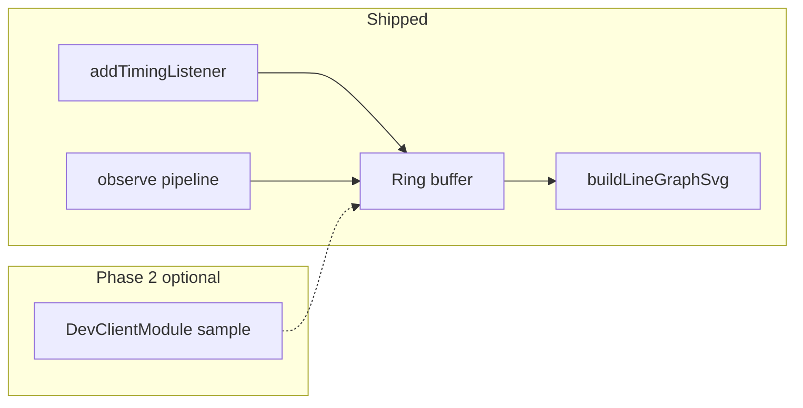

<!-- 1dc21125-3e0c-4ab5-9495-34b8b8d7f5ff -->
---
todos:
  - id: "wire-apis"
    content: "addTimingListener + PerformanceObserver pipeline, ring buffer, cleanup (DONE in tamer-dev-client)"
    status: pending
  - id: "viz-line-graph"
    content: "perfLineGraph.ts + SVG line graph in CustomDebugPanel (DONE)"
    status: pending
  - id: "cpu-gpu-followup"
    content: "Optional: DevClientModule native CPU% sampling + second series; document GPU limits"
    status: pending
isProject: false
---
# Performance line graph in CustomDebugPanel — task status

## Completed (Phase 1)

- **`wire-apis`**: Replaced `readPerfText()` with `lynx.performance.addTimingListener` (metrics summary from `TimingInfo.metrics`) and `createObserver` observing **`['pipeline']` only** (not metric/init — reduces noise). Ring buffer `{ t, v }` with trim (~90s window, ~160 points), throttled `setState` (~280ms) plus periodic flush. Cleanup: `removeTimingListener`, `observer.disconnect()`.
- **`viz-line-graph`**: Added [`packages/tamer-dev-client/src/perfLineGraph.ts`](packages/tamer-dev-client/src/perfLineGraph.ts) (`trimPointsWindow`, `buildLineGraphSvg` with grid). [`CustomDebugPanel.tsx`](packages/tamer-dev-client/src/components/CustomDebugPanel.tsx) renders Task Manager–style SVG polyline, labels clarifying **Lynx pipeline ms ≠ OS CPU**, last value + point count.

## Pending / optional (Phase 2)

- **`cpu-gpu-followup`**: If OS-level **CPU%** (and optionally memory) lines are required: extend **`DevClientModule`** on Android/iOS with a `devCall` or timer-driven callback, sample process CPU, append a second `{ t, v }` series and extend `buildLineGraphSvg` (or a second polyline) with legend. **GPU%** cross-platform is weakly specified — document limitations or omit.

## Reference architecture (unchanged)

## Notes for future edits

- Do not revert to `Object.keys(lynx.performance)` for metrics.
- If pipeline events are too sparse on some hosts, consider widening observe list (e.g. `metric`) only after profiling volume.
