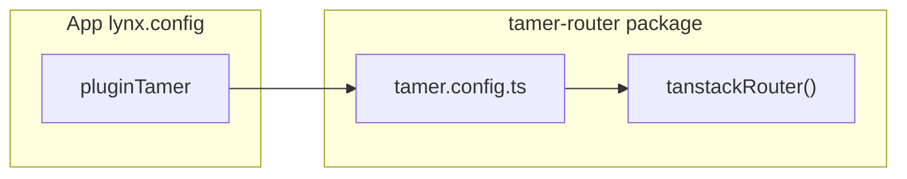

# TanStack Router: owned by tamer-router, not example

## Context

- [Lynx TanStack Router doc](https://lynxjs.org/react/routing/tanstack-router.md) shows `**react$` → compat**, `**tanstackRouter({ target: 'react' })`**, memory history, `**isServer: false`**, and `**url-search-params-polyfill**` in the entry. Your repo already centralizes the Rspack pieces through `[packages/tamer-router/tamer.config.ts](packages/tamer-router/tamer.config.ts)` and `[packages/tamer-plugin/src/plugin.ts](packages/tamer-plugin/src/plugin.ts)` (including `**modifyRsbuildConfig` `order: 'post'**` so `react$` wins over `@lynx-js/react-alias-rsbuild-plugin`).
- [Tamer configuration guide](https://tamer4lynx.github.io/guide/configuration.md): apps use `**pluginTamer()**` and load `**tamer.config**` from packages that export `./tamer.config`—**not** by duplicating TanStack plugin wiring in every app’s `lynx.config.ts`.

## What is already true

- `[packages/example/lynx.config.ts](packages/example/lynx.config.ts)` does **not** import `@tanstack/router-plugin` or call `tanstackRouter`; it relies on `**pluginTamer`** + merged preset from `**@tamer4lynx/tamer-router/tamer.config`**.
- `[packages/tamer-router/tamer.config.ts](packages/tamer-router/tamer.config.ts)` is the **only** place that should import `**tanstackRouter`** from `@tanstack/router-plugin/rspack`.

## Gap to close (bundler plugin)

- `[packages/example/package.json](packages/example/package.json)` still lists `**@tanstack/router-plugin`** under **devDependencies** even though the example no longer uses it—**remove** it so the app does not “own” that dependency. Hoisted installs will still satisfy `**@tamer4lynx/tamer-router`**’s **peer** on `@tanstack/router-plugin`.
- Same cleanup for `[packages/tamer-dev-client/package.json](packages/tamer-dev-client/package.json)` (it also lists `@tanstack/router-plugin` but should rely on **tamer-router** + workspace hoisting).

**Peer contract:** Keep `**@tanstack/router-plugin`** as a **peerDependency** of `[packages/tamer-router/package.json](packages/tamer-router/package.json)` (already present) so consumers install a compatible version; **tamer-router** keeps it in **devDependencies** for its own `tamer.config` build.

## “Compiled exports” for `@tanstack/react-router` (runtime API)

**Constraint:** `@tanstack/router-generator` **hardcodes** import strings like `from '@tanstack/react-router'` in generated output (see `fullPkg` / templates in `node_modules/@tanstack/router-generator/dist/esm/template.js`). There is **no** supported `tsr.config.json` field in the current schema to point codegen at `@tamer4lynx/tamer-router/...` without upstream changes.

Two coherent options:

| Approach                                                              | Pros                                                                                             | Cons                                                                                                    |
| --------------------------------------------------------------------- | ------------------------------------------------------------------------------------------------ | ------------------------------------------------------------------------------------------------------- |
| **A. Document + keep `@tanstack/react-router` in app `dependencies`** | Matches codegen; simplest; types line up with generator                                          | App still declares `@tanstack/react-router`                                                             |
| **B. Add a tamer subpath + optional resolve alias**                   | All **bundled** imports can be forced through a **compiled** re-export file under `tamer-router` | Needs careful **Rspack** alias design to avoid self-import loops; must be merged **post** like `react$` |

**Recommended implementation for B (if you want “everything through tamer-router”):**

1. Add a small compiled module, e.g. `[packages/tamer-router/src/tanstack-react.ts](packages/tamer-router/src/tanstack-react.ts)`, containing only: `export * from '@tanstack/react-router'`.
2. Export it via `[packages/tamer-router/package.json](packages/tamer-router/package.json)` `**exports`** (e.g. `"./tanstack-react"` or `"./tanstack"`).
3. Add **two** `resolve.alias` entries in `**tamer-router`’s merged `rsbuildConfig`** (applied in **post** order by `tamer-plugin`):
  - Map a **private** name (e.g. `__tanstack_react_router_src__`) to `require.resolve('@tanstack/react-router')` (or ESM equivalent).
  - Map `**@tanstack/react-router`** to the **compiled** re-export file, where the re-export uses the **private** name (so the re-export does not resolve back to itself).
4. Migrate **hand-written** app imports (`index.tsx`, `routes/*.tsx`) to `**@tamer4lynx/tamer-router/tanstack`** **only if** you **skip** the alias shim; with the alias shim, **generated** `routeTree.gen.ts` can stay unchanged.
5. **TypeScript:** ensure `tsconfig` / `paths` or **types** from the new export so IDEs resolve types without duplicate version skew.

**Without B:** keep `**@tanstack/react-router`** in `[packages/example/package.json](packages/example/package.json)` **dependencies** for types and runtime; still remove `**@tanstack/router-plugin`** from apps.

## Docs / README

- Update `[packages/tamer-router/README.md](packages/tamer-router/README.md)` to state explicitly:
  - **Do not** add `tanstackRouter` to app `lynx.config`; use `**pluginTamer`** + `**@tamer4lynx/tamer-router/tamer.config`**.
  - **Peer deps:** `@tanstack/react-router` and `@tanstack/router-plugin` (for the preset).
  - How **example** should depend on TanStack (A vs B above).

## Verification

- `npm run build` for `**packages/example`** (and `**tamer-dev-client`** if touched).
- `t4l start` / device: confirm bundle loads (existing **PrimJS** `loadCard` / stack-underflow issues are **orthogonal** to this packaging change unless the alias approach alters the graph).

